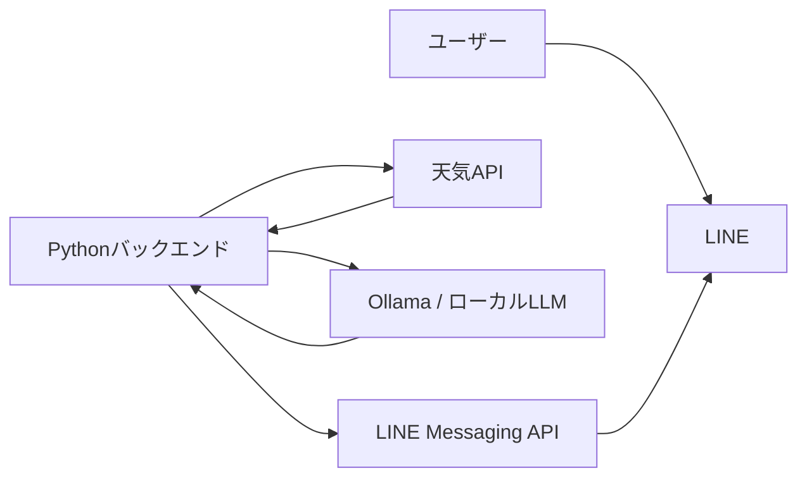
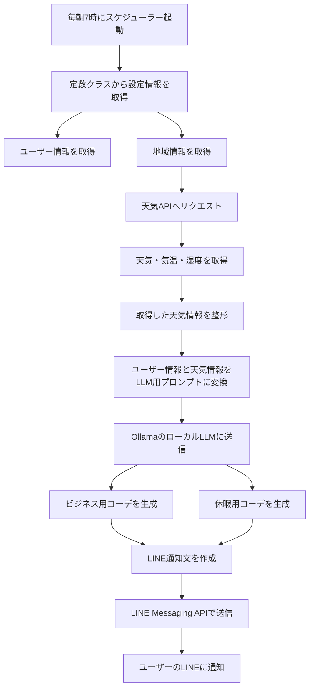

# 今日のおすすめコーデLINE通知アプリ 要件定義書

## 1. アプリ概要

毎朝7時に、指定した地域の天気情報を取得し、ローカルLLMで今日のおすすめコーデを生成してLINEに通知するアプリです。

本アプリはリリースを想定せず、個人利用のためにローカルPC上で運用します。

---

## 2. 作成目的

- 毎朝、自動で今日の服装をLINEに通知したい
- 天気、気温、湿度をもとに服装を提案したい
- ビジネス用と休暇用の2パターンのコーデを提案したい
- 住んでいる場所が変わっても、定数を書き換えるだけで対応できるようにしたい
- 外部の生成AI APIではなく、ローカルLLMを使いたい
- DBは使用せず、シンプルな構成にしたい

---

## 3. 前提条件

- ローカルPCで動作すること
- リリース、公開、サーバー運用は考えない
- DBは使用しない
- 個人情報はソースコード内の定数クラスに設定する
- AIはOllamaを利用したローカルLLMを想定する
- LINE通知はLINE Messaging APIを利用する
- 毎朝7時に自動実行する

---

## 4. 使用技術

| 区分 | 技術 |
|---|---|
| バックエンド | Python |
| Webフレームワーク | Flask または FastAPI。指定がなければFlask |
| AI | Ollama + ローカルLLM |
| 天気API | Open-Meteo APIなどの無料天気API |
| LINE通知 | LINE Messaging API |
| スケジューラー | APScheduler |
| DB | 不要 |
| 実行環境 | ローカルPC |

---

## 5. システム構成イメージ



---

## 6. 主な処理フロー

### 6.1 毎朝7時の自動通知フロー



### 6.2 処理手順

1. 毎朝7時にAPSchedulerで処理を開始する
2. 定数クラスから以下の情報を取得する
   - 名前
   - 性別
   - 年齢
   - 身長
   - 住んでいる場所
   - 緯度
   - 経度
   - LINE通知設定
3. 天気APIに対して、設定された場所の天気情報を取得する
4. 以下の情報を取得する
   - 天気
   - 最低気温
   - 最高気温
   - 現在気温
   - 湿度
   - 降水確率
5. 天気情報と個人情報をLLMに渡すためのプロンプトを作成する
6. Ollamaで起動しているローカルLLMにプロンプトを送信する
7. LLMから以下の2種類のコーデ提案を取得する
   - ビジネスver
   - 休暇ver
8. LINE通知用の文章に整形する
9. LINE Messaging APIでユーザーに通知する

---

## 7. LINE通知の出力想定

```text
○○さん、おはようございます！

今日の○○の○月○日の天気は○○、気温は最低○○℃ / 最高○○℃、湿度は○○％です。

【ビジネスver】
○○の服装がいいでしょう。

【休暇ver】
○○の服装がいいでしょう。

今日も一日頑張りましょう！
```

### 出力例

```text
拓翔さん、おはようございます！

今日の名古屋市栄の6月6日の天気は晴れ、気温は最低22℃ / 最高30℃、湿度は65％です。

【ビジネスver】
白の半袖シャツにネイビーのスラックスを合わせると、涼しさと清潔感を両立できます。冷房対策として薄手のジャケットを持っておくと安心です。

【休暇ver】
白Tシャツに黒のワイドパンツ、足元はスニーカーがおすすめです。暑さ対策として汗拭きシートや飲み物も持っておくと快適です。

今日も一日頑張りましょう！
```

---

## 8. 定数クラス設計

### 8.1 個人情報設定

個人情報はDBではなく、ソースコード内の定数クラスに設定します。

```python
class UserConfig:
    NAME = "拓翔"
    GENDER = "male"
    AGE = 25
    HEIGHT_CM = 172

    # 任意設定
    STYLE_PREFERENCE = "シンプル、清潔感、きれいめ、韓国系"
    NG_ITEMS = ["派手すぎる服", "奇抜な色"]
    FAVORITE_COLORS = ["黒", "白", "グレー", "ネイビー"]
```

---

### 8.2 場所情報設定

どの場所に住んでいても対応できるよう、住んでいる場所は定数で自由に書き換えられる設計にします。

```python
class LocationConfig:
    LOCATION_NAME = "名古屋市栄"
    LATITUDE = 35.167
    LONGITUDE = 136.907
    TIMEZONE = "Asia/Tokyo"
```

場所を変更する場合は、以下のように書き換えるだけで対応できるようにしてください。

```python
class LocationConfig:
    LOCATION_NAME = "東京都渋谷区"
    LATITUDE = 35.658
    LONGITUDE = 139.701
    TIMEZONE = "Asia/Tokyo"
```

---

### 8.3 LINE設定

```python
class LineConfig:
    CHANNEL_ACCESS_TOKEN = "LINEのチャネルアクセストークン"
    USER_ID = "通知先ユーザーID"
```

---

### 8.4 アプリ設定

```python
class AppConfig:
    NOTIFY_HOUR = 6
    NOTIFY_MINUTE = 0

    OLLAMA_BASE_URL = "http://localhost:11434"
    OLLAMA_MODEL = "qwen2.5"
```

---

## 9. ディレクトリ構成

```text
outfit-line-notifier/
├── main.py
├── config.py
├── requirements.txt
├── services/
│   ├── weather_service.py
│   ├── llm_service.py
│   ├── outfit_service.py
│   └── line_service.py
├── scheduler/
│   └── daily_scheduler.py
├── utils/
│   └── weather_code.py
└── README.md
```

---

## 10. 各ファイルの役割

| ファイル | 役割 |
|---|---|
| main.py | アプリ起動処理 |
| config.py | 個人情報、場所情報、LINE設定、Ollama設定を定義 |
| weather_service.py | 天気APIから天気情報を取得 |
| llm_service.py | OllamaのローカルLLMを呼び出す |
| outfit_service.py | LLM用プロンプト作成、コーデ提案生成 |
| line_service.py | LINE Messaging APIで通知送信 |
| daily_scheduler.py | 毎朝7時のスケジュール実行 |
| weather_code.py | 天気コードを日本語に変換 |
| requirements.txt | Pythonライブラリ一覧 |
| README.md | セットアップ手順 |

---

## 11. 天気情報取得要件

### 11.1 取得したい情報

- 地域名
- 日付
- 天気
- 現在気温
- 最低気温
- 最高気温
- 湿度
- 降水確率

### 11.2 天気APIの取得結果イメージ

```json
{
  "location": "名古屋市栄",
  "date": "2026-06-06",
  "weather": "晴れ",
  "current_temperature": 25,
  "min_temperature": 22,
  "max_temperature": 30,
  "humidity": 65,
  "precipitation_probability": 20
}
```

---

## 12. ローカルLLM要件

### 12.1 使用想定

- Ollamaを使用する
- FlaskまたはPythonからHTTP APIで呼び出す
- 個人情報や位置情報を外部AI APIに送信しない

### 12.2 使用モデル

初期モデルは以下を想定する。

```text
qwen2.5
```

ただし、PCスペックによって以下に変更できるようにする。

- llama3.1
- mistral
- gemma

---

## 13. LLMプロンプト要件

LLMには以下の情報を渡す。

- 名前
- 性別
- 年齢
- 身長
- 好みの服装
- 避けたい服装
- 好きな色
- 地域
- 日付
- 天気
- 最低気温
- 最高気温
- 湿度
- 降水確率

### プロンプト例

```text
あなたはファッションアドバイザーです。
以下のユーザー情報と天気情報をもとに、今日のおすすめコーデを日本語で提案してください。

# ユーザー情報
名前: {name}
性別: {gender}
年齢: {age}
身長: {height}cm
好みのスタイル: {style_preference}
避けたいアイテム: {ng_items}
好きな色: {favorite_colors}

# 天気情報
場所: {location}
日付: {date}
天気: {weather}
現在気温: {current_temperature}℃
最低気温: {min_temperature}℃
最高気温: {max_temperature}℃
湿度: {humidity}%
降水確率: {precipitation_probability}%

# 指示
以下の2パターンで服装を提案してください。

1. ビジネスver
2. 休暇ver

# 条件
- LINEで読みやすい文章にしてください
- 長すぎないようにしてください
- 天気と気温に合った服装を提案してください
- 暑い日は通気性や汗対策に触れてください
- 寒い日は防寒に触れてください
- 雨の日は傘や防水靴に触れてください
- 湿度が高い日は蒸れにくい服装に触れてください
- 清潔感のある現実的な服装にしてください
- 最後に応援メッセージを付けてください
```

---

## 14. LINE通知要件

### 14.1 通知タイミング

- 毎朝7時

### 14.2 通知方法

- LINE Messaging APIのPush Messageを使用する

### 14.3 通知内容

- 名前を含めた朝の挨拶
- 今日の地域名
- 今日の日付
- 天気
- 最低気温
- 最高気温
- 湿度
- ビジネスverの服装提案
- 休暇verの服装提案
- 応援メッセージ

---

## 15. エラー処理要件

### 15.1 天気API取得失敗時

- エラーログを出力する
- LINE通知は送信しない、または「天気取得に失敗しました」と通知する

### 15.2 Ollama接続失敗時

- Ollamaが起動していない可能性をログに出す
- 例：`Ollamaに接続できません。ollama serveが起動しているか確認してください。`

### 15.3 LINE通知失敗時

- HTTPステータスコードとレスポンス内容をログに出す
- チャネルアクセストークン、ユーザーIDが正しいか確認できるようにする

---

## 16. requirements.txt

```txt
requests
APScheduler
Flask
```

Flaskを使わずに完全なバッチアプリにする場合は、Flaskは不要です。
ただし、動作確認用APIを作るならFlaskを使ってください。

---

## 17. セットアップ手順

### 17.1 Ollamaをインストール

OllamaをローカルPCにインストールする。

### 17.2 Ollamaを起動

```bash
ollama serve
```

### 17.3 モデルを取得

```bash
ollama pull qwen2.5
```

### 17.4 Pythonライブラリをインストール

```bash
pip install -r requirements.txt
```

### 17.5 設定値を入力

`config.py` に以下を設定する。

- 名前
- 性別
- 年齢
- 身長
- 地域名
- 緯度
- 経度
- LINEチャネルアクセストークン
- LINEユーザーID

### 17.6 アプリ起動

```bash
python main.py
```

---

## 18. 手動実行要件

毎朝7時の自動実行だけでなく、開発中に手動実行できる関数を用意してください。

例：

```bash
python main.py --run-now
```

または、`main.py` 実行時にすぐ1回通知するモードを用意してください。

---

## 19. Claudeへの実装指示

この要件定義書をもとに、Pythonでアプリを実装してください。

実装条件は以下です。

- バックエンドはPythonで実装してください
- Flaskを使う場合は、手動実行用APIも作成してください
- DBは使用しないでください
- 個人情報、地域情報、LINE設定、Ollama設定は `config.py` の定数クラスにまとめてください
- AIはOllamaのローカルLLMを使用してください
- 外部のGPT APIは使用しないでください
- 天気情報は無料の天気APIから取得してください
- 毎朝7時にAPSchedulerで自動実行してください
- LINE Messaging APIでPush通知してください
- LINE通知にはビジネスverと休暇verの2種類のコーデ提案を含めてください
- ローカル運用前提のため、認証機能やDBは不要です
- エラー時は原因が分かるようにログを出力してください
- 初回実装ではシンプルに動作することを優先してください

## 20. ローカルPython環境への影響防止

既存のPython環境を変更しないため、必ずプロジェクト専用の仮想環境を作成してください。

- Pythonのグローバル環境に直接 `pip install` しないこと
- `outfit-line-notifier/.venv` を作成して、その中に必要なライブラリをインストールすること
- `requirements.txt` はバックエンド用に作成すること
- 起動手順には仮想環境の作成・有効化・依存関係インストール手順を明記すること

### Windows想定の起動手順

```bash
cd outfit-line-notifier
python -m venv .venv
.venv\Scripts\activate
pip install -r requirements.txt
python app.py

### Mac想定の起動手順

```bash
cd outfit-line-notifier
python3 -m venv .venv
source .venv/bin/activate
pip install -r requirements.txt
python app.py